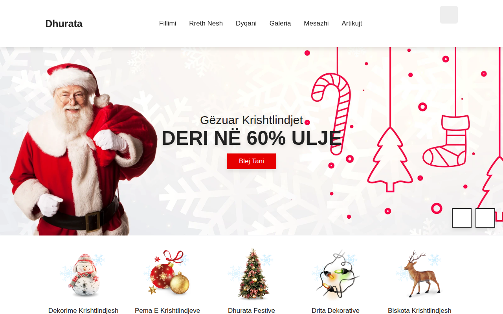

# Christmas-Website 🎄

Faqe interneti festive për Krishtlindje — urime të ngrohta, dekorime, dyqan dhuratash, galeri, blog dhe formular kontakti, e gjitha në gjuhën shqipe.



## 🌐 Demo live

**https://erionnezha.github.io/Christmas-Website/**

## ✨ Çfarë përmban

- 🎅 Hero me slider dhe urime Krishtlindjesh
- 🎁 Seksion kategorish (dekorime, pema, dhurata, drita…)
- 🛍️ Dyqan me produkte festive dhe çmime
- 🖼️ Galeri fotografish
- ✉️ Formular kontakti
- 📰 Artikuj/blog festive
- 📱 Dizajn responsive (përshtatet për celular, tablet dhe desktop)

## 🚀 Si ta hapësh lokalisht

1. Shkarko ose klono këtë repo:
   ```bash
   git clone https://github.com/ErionNezha/Christmas-Website.git
   ```
2. Hape file-in `index.html` në browser — nuk nevojitet server apo instalim.

## 🛠️ Teknologjitë

- HTML5
- CSS3 (custom, responsive)
- JavaScript (vanilla)
- Font Awesome (ikona)

## 👤 Autori

**Erion Nezha** — Tiranë, Shqipëri
📧 shembull@example.com · 📞 +355 6XX XXX XXX

## 📄 Licenca

Ky projekt është i licencuar nën licencën MIT — shiko file-in [LICENSE](LICENSE) për detaje.

---

# Christmas-Website 🎄 (English)

A festive Christmas website — warm greetings, decorations, a gift shop, gallery, blog and contact form, fully in Albanian.


## 🌐 Live demo

**https://erionnezha.github.io/Christmas-Website/**

## ✨ Features

- 🎅 Hero slider with Christmas greetings
- 🎁 Categories section (decorations, trees, gifts, lights…)
- 🛍️ Shop with festive products and prices
- 🖼️ Photo gallery
- ✉️ Contact form
- 📰 Festive blog posts
- 📱 Responsive design (mobile, tablet and desktop)

## 🚀 Run locally

1. Download or clone this repo:
   ```bash
   git clone https://github.com/ErionNezha/Christmas-Website.git
   ```
2. Open `index.html` in a browser — no server or installation needed.

## 🛠️ Technologies

- HTML5
- CSS3 (custom, responsive)
- JavaScript (vanilla)
- Font Awesome (icons)

## 👤 Author

**Erion Nezha** — Tirana, Albania
📧 shembull@example.com · 📞 +355 6XX XXX XXX

## 📄 License

This project is licensed under the MIT License — see the [LICENSE](LICENSE) file for details.
